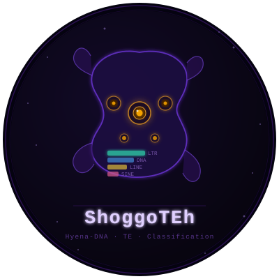

# ShoggoTEh

<p align="center">
  
</p>

<p align="center">
  
  
  
</p>

<p align="center">
  <a href="CHANGELOG.md">Changelog</a>
</p>

A deep learning pipeline for identifying and classifying transposable elements (TEs) in plant genomes using DNA language model embeddings.

ShoggoTEh uses a pretrained DNA language model — [Hyena-DNA](https://github.com/HazyResearch/hyena-dna) by default, with [Nucleotide Transformer](https://github.com/instadeepai/nucleotide_transformer) and [PlantCaduceus](https://github.com/kuleshov-group/PlantCaduceus) available as swappable alternative embedding backbones (`--backbone`) — to generate per-nucleotide sequence embeddings, pools them into small bins (default 50bp), and runs a dense (per-bin) CNN + linear-chain CRF sequence labeler to distinguish TE classes, genic, and intergenic regions at near-base-level resolution — without relying on alignment-based repeat detection.

> *Named after the Shoggoths of H.P. Lovecraft's mythos — shapeshifting entities, much like transposable elements that continuously reshape the genome.*

All five pipeline stages live in a single entry point, `scripts/ShoggoTEh.py`, invoked as subcommands (`python3 scripts/ShoggoTEh.py <subcommand> ...`).

## Overview

```
species.tsv  (species_id, fasta, bed, gff3)
      │
      ▼
ShoggoTEh.py prepare_dataset       Slide windows (default 5 kb) across each
                                    genome; label every small bin (default
                                    50bp) with the exact repeat/gene interval
                                    it falls in — no majority-vote threshold.
                                    Output: {outdir}/{species}.parquet
      │
      ▼
ShoggoTEh.py generate_embeddings   Run chunks through the chosen embedding
                                    backbone (frozen; --backbone hyena by
                                    default, or nucleotide_transformer /
                                    plantcaduceus) and pool per-token hidden
                                    states into per-bin embeddings
                                    ([n_bins, hidden_dim]).
                                    Output: {outdir}/{species}.parquet
      │
      ▼
ShoggoTEh.py train_classifier      Train a 1D-CNN (local-context smoothing)
                                    + linear-chain CRF (Viterbi decode) on
                                    the per-bin embeddings.
                                    Output: {outdir}/classifier.pt,
                                            label_encoder.json,
                                            model_config.json
      │
      ▼
ShoggoTEh.py predict                Slide windows across a new genome, embed,
                                    run the dense CNN+CRF forward pass +
                                    Viterbi decode, and run-length-encode
                                    consecutive same-label bins into BED
                                    intervals.
                                    Output: {prefix}.bed, {prefix}_bin_probs.tsv


ShoggoTEh.py compare_te_annotation  Compare predictions against a reference
  -t target.bed                      annotation (e.g. EarlGrey). Assigns a
  -r reference.bed                   reference label per interval by
  [--gff3 genes.gff3]                majority bp overlap and computes
                                      per-class and overall metrics.
                                      Output: {prefix}_comparison.tsv,
                                              {prefix}_metrics.tsv
```

## Labels

| Label | Description |
|-------|-------------|
| `LTR` | LTR retrotransposons (Gypsy, Copia, etc.) |
| `DNA` | DNA transposons (hAT, Helitron, Tc1-Mariner, etc.) |
| `LINE` | Long interspersed nuclear elements |
| `SINE` | Short interspersed nuclear elements |
| `Unknown_repeat` | Unclassified repetitive elements |
| `Other_repeat` | Satellites, simple repeats, low complexity (training only) |
| `Genic` | Regions overlapping gene models (requires GFF3) |
| `Intergenic` | Non-repetitive, non-genic regions |

## Installation

```bash
conda env create -f envs/shoggoTEh.yaml
conda activate shoggoTEh
```

## Usage

### 1. Prepare `data/species.tsv`

Tab-separated file with one species per line:

```
# species_id<TAB>fasta<TAB>bed<TAB>gff3
Arabidopsis_thaliana    /path/to/genome.fa    /path/to/filteredRepeats.bed    /path/to/annotation.gff3
Oryza_sativa            /path/to/genome.fa    /path/to/filteredRepeats.bed    NA
```

- `bed` should be the EarlGrey `filteredRepeats.bed` output
- `gff3` is optional — use `NA` if not available

### 2. Prepare the dataset (dense per-bin labeling)

```bash
python3 scripts/ShoggoTEh.py prepare_dataset \
    --species_tsv data/species.tsv \
    --outdir data/chunks/
```

| Option | Default | Description |
|--------|---------|-------------|
| `--chunk_size` | `5000` | Window size in bp |
| `--bin_size` | `50` | Per-bin label/embedding resolution in bp; must evenly divide `--chunk_size` |
| `--overlap` | `0.5` | Fractional overlap between windows |
| `--max_n_fraction` | `0.1` | Max N fraction allowed per chunk |
| `--force` | off | Reprocess all species even if output Parquet already exists |
| `--dry_run` | off | Validate inputs, print steps, exit without running |
| `--disable_co2_tracking` | off | Skip codecarbon energy/CO₂ tracking for this run |

Every bin gets the exact label of whichever repeat/gene interval it falls in dominantly — no window-level `min_fraction` threshold, no "mixed window" discard (the old majority-vote logic that structurally failed on short, dispersed classes like SINE is retired).

Output: one Parquet file per species under `data/chunks/` with columns `species`, `chrom`, `start`, `end`, `sequence`, `bin_labels` (list[str], length `n_bins`), `n_bins`, `bin_size`, `repeat_fraction`.

### 3. Generate embeddings (dense per-bin pooling)

```bash
python3 scripts/ShoggoTEh.py generate_embeddings \
    --chunks_dir data/chunks/ \
    --outdir data/embeddings/
```

| Option | Default | Description |
|--------|---------|-------------|
| `--backbone` | `hyena` | Embedding backbone: `hyena`, `nucleotide_transformer`, or `plantcaduceus` — see [Embedding backbones](#embedding-backbones) below |
| `--backbone_model` | backbone's own default | HuggingFace Hub checkpoint override for `--backbone` (e.g. a larger Nucleotide Transformer or PlantCaduceus variant). Formerly `--model` (renamed; `--model` no longer exists) |
| `--bin_size` | `50` | Per-bin pooling resolution in bp; must match the chunks' `bin_size` |
| `--batch_size` | `32` | Sequences per forward pass |
| `--device` | auto | `cuda`, `mps`, or `cpu` |
| `--force` | off | Reprocess all species even if output Parquet already exists |
| `--dry_run` | off | Validate inputs, print steps, exit without running |
| `--disable_co2_tracking` | off | Skip codecarbon energy/CO₂ tracking for this run |

Each backbone's per-token hidden states are pooled into per-bin embeddings by `embed_sequences_dense()`, which works identically regardless of tokenization scheme: the effective **tokens-per-bp ratio is computed dynamically per sequence** (`valid_content_token_len / len(raw_sequence_bp)`, after generically dropping whichever of CLS/BOS/EOS/SEP special tokens the tokenizer added), then each bin pools `round(bin_size * tokens_per_bp)` tokens. This means the pipeline needs no per-backbone hardcoding for Hyena-DNA's 1-token/bp scheme vs. Nucleotide Transformer's ~6-tokens/bp (6-mer, with single-nucleotide fallback tokens for remainders) vs. whatever PlantCaduceus turns out to use. The chosen backbone stays frozen (no fine-tuning).

Output: one Parquet file per species under `data/embeddings/` with columns `species`, `chrom`, `start`, `end`, `bin_labels`, `n_bins`, `bin_size`, `repeat_fraction`, `embedding_bytes` (raw `float32` bytes of the `[n_bins x hidden_dim]` array, decoded via `np.frombuffer`), `hidden_dim`, `backbone`, `backbone_model` (the last two record exactly which backbone + checkpoint produced this species' embeddings, so `train_classifier` can detect a mixed-backbone corpus instead of silently training on incompatible embedding spaces). The `sequence` column is dropped to save space; it remains in the chunks Parquet. Embeddings are stored as raw bytes rather than nested Python float lists — at genome scale, `.tolist()`-style boxing inflates RAM far beyond the raw array size and can OOM the process during DataFrame construction.

#### Embedding backbones

An explicit A/B-testing feature for comparing pretrained genomic language models on TE classification accuracy/speed — **not a replacement for the Hyena-DNA default**.

| `--backbone` | Default `--backbone_model` | Loaded via | Hidden states from |
|---|---|---|---|
| `hyena` (default) | `LongSafari/hyenadna-medium-160k-seqlen-hf` | `AutoModel` / `AutoTokenizer` | `out.last_hidden_state` |
| `nucleotide_transformer` | `InstaDeepAI/nucleotide-transformer-v2-50m-multi-species` | `AutoModel` / `AutoTokenizer` | `out.last_hidden_state` |
| `plantcaduceus` | `kuleshov-group/PlantCaduceus_l20` | `AutoModelForMaskedLM` / `AutoTokenizer` (note: **not** plain `AutoModel`) | `out.hidden_states[-1]` (called with `output_hidden_states=True`) |

All three load with `trust_remote_code=True`. To add a fourth backbone, add one entry to `BACKBONE_REGISTRY` in `scripts/ShoggoTEh.py` (a `load_fn(model_name, device) -> (tokenizer, model)`, the right `hidden_state_fn`, and `forward_kwargs` if the model needs `output_hidden_states=True` or similar) — the shared batching/pooling loop in `embed_sequences_dense()` needs no changes.

### 4. Train classifier (1D-CNN + linear-chain CRF)

```bash
python3 scripts/ShoggoTEh.py train_classifier \
    --embeddings_dir data/embeddings/ \
    --outdir models/plant_classifier/
```

| Option | Default | Description |
|--------|---------|-------------|
| `--labels` | `LTR DNA LINE SINE Unknown_repeat Other_repeat Genic Intergenic` | Ordered list of class labels |
| `--epochs` | `50` | Maximum training epochs |
| `--batch_size` | `64` | Mini-batch size in chunks/sequences |
| `--lr` | `0.001` | Adam learning rate |
| `--cnn_channels` | `128` | 1D-CNN channel width |
| `--kernel_size` | `5` | 1D-CNN kernel size in bins |
| `--dropout` | `0.3` | Dropout probability |
| `--val_fraction` | `0.2` | Fraction of chunks held out for validation (stratified by each chunk's dominant bin label) |
| `--patience` | `10` | Early-stopping patience in epochs |
| `--class_weight` | `balanced` | `balanced` reweights the CRF's per-sequence NLL by inverse **per-bin** training-set class frequency (ported from the old per-window frequency); `none` disables it |
| `--balanced_corpus` | off | Build the training set via quota-capped, multi-genome chunk selection (rarest class first) instead of using every pooled chunk — fixes rare-class scarcity by exposure, not just loss weighting. Selection operates on whole chunks, never individual bins, so the CRF's sequence context is preserved |
| `--target_bins_per_class` | `20000` | Target per-class bin count for `--balanced_corpus`; classes with fewer bins available across the whole pooled corpus fall short by construction (logged per class) |
| `--seed` | `42` | Random seed |
| `--device` | auto | `cuda`, `mps`, or `cpu` |
| `--dry_run` | off | Validate inputs, print steps, exit without running |
| `--disable_co2_tracking` | off | Skip codecarbon energy/CO₂ tracking for this run |

Model: `Conv1d(hidden_dim → cnn_channels, k=kernel_size) → ReLU → Dropout → Linear(cnn_channels, n_classes) → LinearChainCRF`. The CRF (transition matrix + forward algorithm + Viterbi decode) is implemented from scratch to avoid a new pip dependency, and discourages single-bin "flapping" misclassifications inside otherwise-uniform runs — the standard fix for this failure mode in sequence labeling (BiLSTM-CRF for NER/POS).

Output files in `--outdir`:

| File | Description |
|------|-------------|
| `classifier.pt` | Best model weights (CNN + CRF state dicts) |
| `label_encoder.json` | Label ↔ index mapping |
| `model_config.json` | Architecture hyperparameters, plus `backbone`/`backbone_model` — read back from the embeddings' own recorded provenance (not from any CLI flag), and used to reload the model and validate/auto-correct `predict`'s `--backbone`/`--backbone_model` |
| `training_metrics.tsv` | Per-epoch train/val loss and **bin-level** accuracy |
| `classification_report.txt` | Per-class precision, recall, F1 on the validation set (bin-level, post-CRF-decode) |

### 5. Predict on a new genome (dense forward pass + CRF decode)

```bash
python3 scripts/ShoggoTEh.py predict \
    --fasta new_genome.fa \
    --model_dir models/plant_classifier/ \
    --outdir predictions/
```

| Option | Default | Description |
|--------|---------|-------------|
| `--prefix` | FASTA stem | Output filename prefix |
| `--backbone` | `hyena` | Embedding backbone (see [Embedding backbones](#embedding-backbones)). Formerly `--hyena_model` selected the checkpoint directly; that flag no longer exists |
| `--backbone_model` | backbone's own default | HuggingFace Hub checkpoint override for `--backbone` |
| `--chunk_size` | `5000` | Window size in bp |
| `--bin_size` | `50` | Per-bin resolution in bp; must match the trained model's `bin_size` |
| `--overlap` | `0.0` | Fractional overlap between windows — the dense architecture does not need the old pipeline's redundant 50% overlap |
| `--max_n_fraction` | `0.1` | Windows above this N fraction are skipped |
| `--batch_size` | `32` | Embedding + forward-pass batch size |
| `--device` | auto | `cuda`, `mps`, or `cpu` |
| `--dry_run` | off | Validate inputs, print steps, exit without running |
| `--disable_co2_tracking` | off | Skip codecarbon energy/CO₂ tracking for this run |

**Backbone/checkpoint mismatch safeguard**: `model_dir/model_config.json` records the exact backbone + checkpoint the classifier was actually trained on (read back from the embeddings' own provenance at training time, not from a CLI flag). If `--backbone`/`--backbone_model` disagree with what's recorded — including the default `--backbone hyena` disagreeing with a model trained on a different backbone — `predict` logs a `WARNING` and **auto-corrects to the recorded values** rather than silently embedding the input genome with an incompatible embedding space.

Per-bin predictions (post Viterbi decode) are run-length-encoded: consecutive bins with the same label are merged into a single BED interval, with confidence = mean per-bin softmax probability of the assigned label across the merged interval.

Output files in `--outdir`:

| File | Description |
|------|-------------|
| `{prefix}.bed` | Merged intervals: `chrom start end label confidence .` |
| `{prefix}_bin_probs.tsv` | Full per-bin softmax probability for every class (pre-merge) |

### 6. Compare against a reference annotation

```bash
# Repeat classes only
python3 scripts/ShoggoTEh.py compare_te_annotation \
    -t predictions/genome.bed \
    -r filteredRepeats.bed \
    --outdir comparisons/

# With gene models for Genic/Intergenic resolution
python3 scripts/ShoggoTEh.py compare_te_annotation \
    -t predictions/genome.bed \
    -r filteredRepeats.bed \
    --gff3 annotation.gff3 \
    --outdir comparisons/
```

| Option | Default | Description |
|--------|---------|-------------|
| `-t / --target` | required | ShoggoTEh BED output (`predict`) |
| `-r / --reference` | required | Reference BED (e.g. EarlGrey `filteredRepeats.bed`) |
| `--gff3` | None | Gene annotation GFF3 — resolves `Genic` vs `Intergenic` for non-repeat intervals |
| `--prefix` | target BED stem | Output filename prefix |
| `--min_fraction` | `0.5` | Min overlap fraction to assign a reference label |
| `--dry_run` | off | Validate inputs, print steps, exit without running |

This subcommand needed no logic changes for the dense architecture — `assign_reference_labels()` already operates on arbitrary-length intervals, and predict's merged BED intervals are just another set of arbitrary-length intervals. Reference labels are normalised to the ShoggoTEh label set using the same `REPEAT_CLASS_MAP` as `prepare_dataset` (`LTR/Gypsy` → `LTR`, `DNA/hAT` → `DNA`, etc.). Intervals where no single repeat class reaches `--min_fraction` are marked `Ambiguous`, reported in the comparison file, and excluded from the metrics.

Output files in `--outdir`:

| File | Description |
|------|-------------|
| `{prefix}_comparison.tsv` | Per-interval detail: target label, reference label, overlap bp and fraction, match (True/False) |
| `{prefix}_metrics.tsv` | Per-class precision, recall, F1 and support; macro and weighted averages; overall accuracy; confusion matrix |

## Run log

Every subcommand writes a run log to `{outdir}/logs/Run_ShoggoTEh_{command}.log`. The header records:

```
## Run: ShoggoTEh.py prepare_dataset
## Date: 2026-07-23 10:00:00
## User: aubombarely
## Server: my-workstation
## OS: Linux-5.15.0
## Working directory: /home/aubombarely/ShoggoTEh
## Command: python3 scripts/ShoggoTEh.py prepare_dataset --species_tsv data/species.tsv --outdir data/chunks/
```

All subsequent log messages are captured in the same file.

## Run summary

Every subcommand writes `{outdir}/run_summary.json` at the end of a successful run. It records date, script version, key inputs, result counts, parameters, and resource usage:

```json
{
  "version": "v0.3.0",
  "date": "2026-07-23 10:05:12",
  "n_species_processed": 3,
  "total_records_written": 12450,
  "parameters": {"chunk_size": 5000, "bin_size": 50, "overlap": 0.5, "max_n_fraction": 0.1},
  "resource_usage": {"wall_clock_s": 47.3, "peak_mem_mb": 284.1, "emissions_kg_CO2eq": 0.000021}
}
```

## Carbon footprint tracking

ShoggoTEh tracks energy consumption and CO₂ equivalent emissions for the ML-workload subcommands (`prepare_dataset`, `generate_embeddings`, `train_classifier`, `predict`) using [CodeCarbon](https://github.com/mlco2/codecarbon).

- `codecarbon` is an **optional dependency** — the pipeline runs normally without it.
- Pass `--disable_co2_tracking` to skip tracking for a specific run (e.g. on cluster nodes that block network access).
- Emissions are reported in the run log and included in `run_summary.json` under `resource_usage.emissions_kg_CO2eq`.

## Test data

A small synthetic dataset is provided in `test/` for validating `prepare_dataset` without downloading Hyena-DNA model weights.

```bash
# Generate (or regenerate) test files
python3 test/make_test_data.py

# Quick test — no GPU required, runs in < 30 s (requires a system bedtools binary)
conda activate shoggoTEh
python3 scripts/ShoggoTEh.py prepare_dataset \
    --species_tsv test/species.tsv \
    --outdir test/chunks/ \
    --chunk_size 5000 \
    --bin_size 50 \
    --overlap 0.5
```

Expected output: `test/chunks/test_species.parquet` (~30 labeled chunks, each with a `bin_labels` array of 100 per-bin labels), `test/chunks/logs/Run_ShoggoTEh_prepare_dataset.log`, `test/chunks/run_summary.json`.

`generate_embeddings`, `train_classifier`, and `predict` require the Hyena-DNA model weights (~1.5 GB from HuggingFace) and benefit from a GPU; see `test/README.md` for the full end-to-end test sequence.

## Configuration

Reference defaults (also the argparse defaults baked into each subcommand):

| Parameter | Default | Description |
|-----------|---------|-------------|
| `chunk_size` | `5000` | Window size in bp |
| `bin_size` | `50` | Per-bin label/embedding resolution in bp |
| `overlap` | `0.5` (prepare_dataset) / `0.0` (predict) | Fractional overlap between windows |
| `max_n_fraction` | `0.1` | Max N fraction per chunk |
| `backbone` | `hyena` | Embedding backbone (`hyena`, `nucleotide_transformer`, `plantcaduceus`) |
| `backbone_model` | backbone's own default | HuggingFace Hub checkpoint override |
| `embedding_batch_size` | `32` | Batch size for embedding generation |

## Training data

ShoggoTEh v0.1.0 is trained on EarlGrey repeat annotations from 185 plant species spanning diverse clades and repeat content profiles.

## Third-party tools

| Tool | Repository |
|------|-----------|
| Hyena-DNA (default `--backbone`) | https://github.com/HazyResearch/hyena-dna |
| Nucleotide Transformer (`--backbone nucleotide_transformer`) | https://github.com/instadeepai/nucleotide_transformer |
| PlantCaduceus (`--backbone plantcaduceus`) | https://github.com/kuleshov-group/PlantCaduceus |
| EarlGrey | https://github.com/TobyBaril/EarlGrey |
| CodeCarbon | https://github.com/mlco2/codecarbon |
| pyfaidx | https://github.com/mdshw5/pyfaidx |
| pybedtools | https://github.com/daler/pybedtools |

## Related tools from our group

- [DeepTE](https://github.com/LiLabAtVT/DeepTE) — TE classification using CNNs
- [annotseba](https://github.com/aubombarely/annotseba) — genome download and QC pipeline
